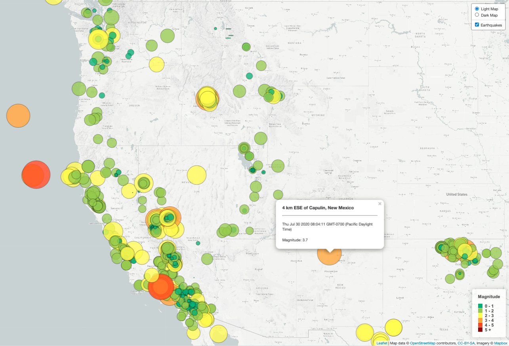

# Project: Earthquake Data Visualization

## Objective:
Build an interactive map to visualize earthquake data from around the world

## Tools:
* Javascript
* Leaflet library
* D3 library
* HTML
* CSS
* Bootstrap library

## Tasks:
1. Get data set from United States Geological Survey (USGS) in JSON from [USGS GeoJSON Feed](http://earthquake.usgs.gov/earthquakes/feed/v1.0/geojson.php)
2. Import and visualize the data by creating a map using Leaflet that plots earthquake from data set based on longitude and latitude.
    * Data markers reflect magnitude of earthquake in size and color. Earthquakes with higher magnitudes appear larger and darker in color.
    * Includes popups that provide additional information about the earthquake when a marker is clicked.
    * Create legend that provides context for map data.

## Website Link:
https://janejanejam.github.io/leaflet-challenge/